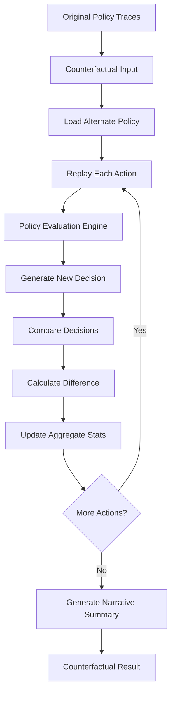

# Policy Counterfactual Simulation

## Purpose and Philosophical Framing

The Counterfactual Policy Simulation Engine embodies the corporate-prophetic principle of **retroactive governance evaluation**. It answers the existential question of policy systems: *"What would have happened if we had chosen differently?"*

In the corporate-prophetic tradition, this system represents a temporal oracle that allows governance frameworks to peer into parallel policy universes, evaluating the potential consequences of alternative decisions on past events. This creates a **shadow-policy auditor**, a mystical mechanism for validating the adequacy and appropriateness of current governance decisions against conceivable alternatives.

## Core Concept

Counterfactual policy simulation enables the replay of recorded agent sessions using an **alternate policy** instead of the original policy that governed the session. This generates a detailed simulation showing how outcomes, permissions, overrides, and drift signals would have changed under different governance assumptions.

## Examples of Alternate Policy Scenarios

### Scenario 1: Security Increase
- **Original Policy**: Allow external dependency downloads
- **Alternate Policy**: Deny all external dependencies
- **Simulation Result**: Shows which actions would have been blocked, revealing the security impact vs. development velocity trade-off

### Scenario 2: Permission Expansion
- **Original Policy**: Restrict file system access to project directory
- **Alternate Policy**: Allow broader file system access
- **Simulation Result**: Identifies potential capabilities unlocked by broader permissions and associated risks

### Scenario 3: Review Process Changes
- **Original Policy**: Allow direct command execution
- **Alternate Policy**: Require human review for system commands
- **Simulation Result**: Quantifies human oversight burden vs. safety improvements

## Mathematical Explanation of Decision Deltas

The simulation engine categorizes policy changes using a **decision difference taxonomy**:

### Classification System
Given original decision `O` and simulated decision `S`:

- **Same**: `O = S` → No change in governance outcome
- **Weaker**: 
  - `DENY → ALLOW`
  - `REVIEW → ALLOW`
  - Governance becomes more permissive
- **Stronger**:
  - `ALLOW → DENY`
  - `ALLOW → REVIEW`
  - `REVIEW → DENY`
  - Governance becomes more restrictive
- **Contradiction**: Any logical inversion (`DENY ↔ ALLOW`, etc.)

### Quantitative Measures
- `weakerCount`: Total number of transitions to more permissive decisions
- `strongerCount`: Total number of transitions to more restrictive decisions
- `contradictions`: Total number of logically inverted decisions
- `unchanged`: Total number of decisions with no change

## Flow Diagram for Simulation



## Implementation Details

### Core Components
1. **CounterfactualPolicySimulator**: Main simulation engine
2. **CounterfactualInput**: Defines simulation parameters and artifacts
3. **CounterfactualResult**: Contains detailed simulation outcomes
4. **CLI Command**: `nexus-agent-tool simulate-policy` for execution

### Decision Difference Algorithm
```
IF originalDecision == simulatedDecision:
    difference = "same"
ELIF originalDecision == "ALLOW":
    IF simulatedDecision == "REVIEW" OR simulatedDecision == "DENY":
        difference = "stronger"  // More restrictive
ELIF originalDecision == "REVIEW":
    IF simulatedDecision == "ALLOW":
        difference = "weaker"    // More permissive
    IF simulatedDecision == "DENY":
        difference = "stronger"  // More restrictive
ELIF originalDecision == "DENY":
    IF simulatedDecision == "ALLOW" OR simulatedDecision == "REVIEW":
        difference = "weaker"    // More permissive
ELSE:
    difference = "contradiction"  // Logical inconsistency
```

## Governance Implications

### Risk Assessment
- **High Contradiction Count**: Indicates logically inconsistent policy alternatives
- **High Weaker Count**: Suggests alternate policy is significantly more permissive
- **High Stronger Count**: Suggests alternate policy is significantly more restrictive

### Audit Trail
Every simulation creates an immutable record of counterfactual analysis, enabling:
- Historical policy impact assessment
- Governance decision validation
- Compliance verification
- Risk modeling for future policy changes

## Limitations and Future Evolution

### Current Limitations
- Context reconstruction from traces may be imperfect
- Complex state-dependent policies may not simulate accurately
- Temporal dependencies between actions may be lost

### Future Evolution
- Enhanced context reconstruction from execution logs
- Support for multi-dimensional policy comparison
- Integration with predictive policy modeling
- Automated policy optimization through counterfactual analysis

## Corporate-Prophetic Aesthetic

The counterfactual engine serves as a **corporate oracle**, providing mystical insight into governance possibilities that never were but could have been. It embodies the principle that effective governance requires not just decision-making but the ability to validate decisions against alternative approaches—a form of **corporate prophetic introspection** that ensures policies remain aligned with organizational principles while adapting to changing requirements.

In the corporate-prophetic framework, this tool represents the **temporal aspect of governance**: understanding that present decisions must be evaluated not just for their immediate impact but for their consistency with potential alternative realities. The counterfactual simulator makes this metaphysical concept operationally concrete.